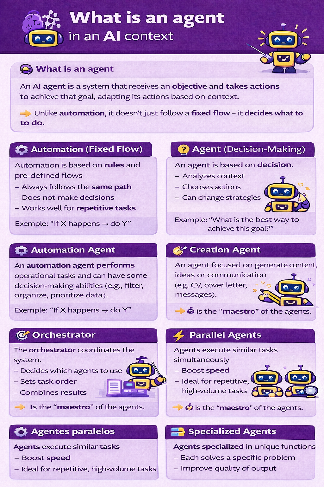

# AI Agents

AI agents are systems that receive a goal, decide what to do next, and take actions to move toward that goal.

Unlike traditional automation, an agent does not just follow a fixed script. It can evaluate context, choose between options, and adapt when conditions change.

---

## Concept

| Concept | Meaning |
|---|---|
| **Automation** | Follows predefined rules |
| **Agent** | Interprets a goal and decides how to achieve it |
| **Parallel agents** | Multiple agents working at the same time for speed |
| **Specialized agents** | Different agents handling different tasks for quality |
| **Orchestrator** | The component that coordinates the whole system |

---

## Automation vs. Agent

| | Automation | Agent |
|---|---|---|
| **Logic** | Fixed workflow | Dynamic decision-making |
| **Behavior** | Repeats the same steps | Adapts based on context |
| **Best for** | Predictable tasks | Ambiguous or changing tasks |
| **Question it answers** | "If X happens, what should run?" | "What is the best way to achieve this goal?" |
| **Example** | Send an email when a form is submitted | Review a job description and decide how to tailor a CV |

Use automation when the path is already known. Use an agent when the goal is clear but the path may vary.

---

## What Makes Something an Agent?

An AI system starts to behave like an agent when it can:

- receive a goal instead of a fixed instruction
- analyze the current context
- choose among multiple actions
- sequence those actions in a useful order
- adapt when the first approach does not work

The key difference is not just "using AI." The key difference is **decision-making in pursuit of a goal**.

---

## Common Types of Agents

| Agent type | What it does | Example |
|---|---|---|
| **Operational agent** | Handles repetitive operational work | Classifies support tickets and routes them to the right queue |
| **Creation agent** | Produces content or drafts | Writes a first version of a cover letter |
| **Research agent** | Gathers and summarizes information | Reviews competitor websites and extracts patterns |
| **Analysis agent** | Interprets information and suggests actions | Compares CV strengths against a job description |

In practice, many real systems combine more than one of these behaviors.

---

## Orchestrator

The orchestrator is the coordinating layer of a multi-agent system.

Its role is to:

- decide which agent should handle each task
- define the order of execution
- pass outputs from one step to the next
- combine the final result

You can think of the orchestrator as the system's traffic controller.

---

## Parallel vs. Specialized Agents

| Pattern | How it works | Main benefit | Example |
|---|---|---|---|
| **Parallel agents** | Several agents do similar work simultaneously | Speed | Analyze 20 job descriptions at once |
| **Specialized agents** | Each agent owns a different type of task | Quality and clarity | One agent analyzes a CV, another writes the cover letter |

These patterns are often combined: an orchestrator may call several specialized agents, and some of them may run in parallel.

- [Custom Sub-Agents Guide (Claude Code for PMs)](https://ccforpms.com/fundamentals/custom-subagents)

The description below was adapted from the model referenced above.

Module 1.4 agents: Temporary clones for parallel batch work
* Created on the fly, used once, then gone
* "Create 10 agents to process 10 meeting notes simultaneously"
* All doing the same type of task at the same time
* Generic capabilities — just copies of me
* Use when you have many similar tasks to do right now
Module 1.5 sub-agents: Permanent specialized team members
* Saved in .claude/agents/ folder, available forever
* "Use the Executive sub-agent to review this spec"
* Each one has a distinct personality, expertise, and communication style
* Called repeatedly whenever you need that perspective
* Use when you need specialized expertise on an ongoing basis

Simple analogy:
* Agents = hiring 10 temp workers for one busy Friday to process paperwork
* Sub-agents = having a permanent team (engineer, executive, researcher) you call on every week
When to use which:
* Processing 15 user interviews at once → agents (parallel batch)
* Getting technical feedback on a spec → sub-agent (Engineer, every time)
* Researching 5 competitors simultaneously → agents (parallel batch)
* Writing an executive summary → sub-agent (Executive, every time)
Does that distinction make sense now?
Now here's the best part — you don't have to build these from scratch. There are 100+ pre-built sub-agents in community libraries. Just copy the .md files into your .claude/agents/ folder and they're ready to use.

---

## Simple Example

Imagine the goal is: **"Help a candidate apply for a product manager role."**

| Step | Agent responsibility |
|---|---|
| 1. Understand the role | A research agent reads the job description |
| 2. Evaluate fit | An analysis agent compares the role with the candidate's CV |
| 3. Create assets | A creation agent drafts a tailored CV and cover letter |
| 4. Coordinate | The orchestrator decides the sequence and combines outputs |

This is more than automation because the system is not just executing one rigid flow. It is choosing how to complete the goal based on context.

---

## When Agents Are Useful

Agents are most useful when:

- the task has multiple steps
- the best next action depends on context
- the inputs vary a lot
- you want the system to make limited decisions without manual intervention

Agents are less useful when the process is simple, repetitive, and fully predictable. In those cases, normal automation is usually better.

---

## Summary

| If you need... | Use... |
|---|---|
| A fixed and repeatable workflow | **Automation** |
| Goal-driven behavior with decision-making | **An agent** |
| Faster throughput across similar tasks | **Parallel agents** |
| Better quality across distinct tasks | **Specialized agents** |
| Coordination across multiple agents | **An orchestrator** |

---

## Diagram

